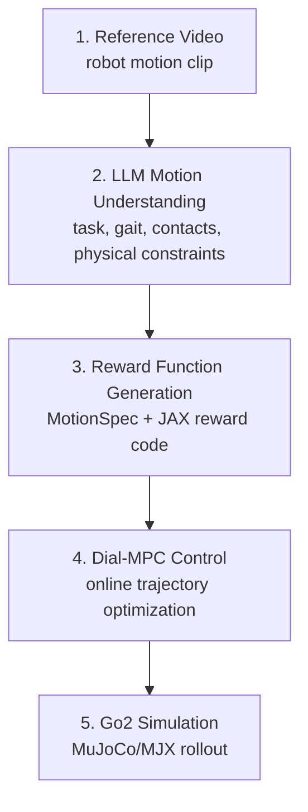

# Zero-Shot Video-to-Robot Motion Transfer

This repository demonstrates a zero-shot robot motion transfer pipeline that uses an LLM to generate reward functions from reference motion videos. The generated reward is connected to Dial-MPC and executed in MuJoCo/MJX simulation with a Unitree Go2 quadruped.

The project focuses on one main question:

> Can a robot motion video be converted into an executable reward function that an MPC controller can use directly?

Instead of manually designing every reward term, the system uses LLM-based visual motion analysis to extract task semantics, gait information, contact patterns, and physical control requirements. These outputs are converted into a structured motion specification and then into JAX-compatible reward code for Dial-MPC.

## Overview



At a high level, the project converts a reference video into a reward function, then uses that reward as the objective for Dial-MPC:

| Stage | Input | Output |
| --- | --- | --- |
| Video understanding | Reference motion video | Structured motion report |
| Reward synthesis | Motion report | `MotionSpec` and `sds_reward_function.py` |
| MPC execution | Generated reward | Go2 simulation rollout |

## Key Contributions

- LLM-based motion understanding pipeline for robot reference videos.
- Prompted analysis agents for task description, contact sequence, gait classification, and physical constraints.
- Reward-generation script that converts an LLM motion report into executable JAX reward code.
- SDS reward module integrated into the Unitree Go2 Dial-MPC environment.
- Simulation stabilization changes for smoother MPC rollout, including startup hold, velocity ramping, warm start, and joint command clamping.

## Repository Structure

```text
.
├── main_sus.py                         # Video frame extraction and LLM analysis pipeline
├── agent_gemini.py                     # Gemini-based SUS agents
├── gen_reward_code.py                  # LLM report to reward-code generator
├── prompts/                            # System prompts for motion understanding
└── dial-mpc/
    └── dial_mpc/
        ├── envs/
        │   ├── sds_reward_function.py  # Generated/configurable SDS reward
        │   └── unitree_go2_env.py      # Go2 environment reward wiring
        ├── deploy/
        │   ├── dial_plan.py            # Dial-MPC planner loop
        │   └── dial_sim.py             # MuJoCo simulation loop
        └── examples/
            └── sds_gallop_sim.yaml     # Example simulation config
```

## Reward Generation

The reward-generation flow starts with a video or URL:

```bash
python main_sus.py \
  --input path/to/reference_motion.mp4 \
  --output output/final_sus_report.txt
```

`main_sus.py` creates a frame grid and runs several LLM analysis agents. The final output is a structured motion report describing the observed motion.

The report is then converted into a motion specification and reward function:

```bash
python gen_reward_code.py \
  --input output/final_sus_report.txt \
  --output dial-mpc/dial_mpc/envs/sds_reward_function.py \
  --spec-out output/motion_spec.json
```

Example `motion_spec.json`:

```json
{
  "mode": "trot_pace",
  "gait": "pace",
  "target_speed_mps": 1.0,
  "base_height_m": 0.3,
  "notes": "heuristic spec"
}
```

The generated reward preserves the original Dial-MPC Go2 gait/contact scaffold while adapting reward targets and weights from the LLM-derived motion specification. Runtime YAML overrides under `reward:` can still tune the final behavior without manually rewriting the reward file.

## Running A Simulation

Create a Python environment and install the local package:

```bash
python3 -m venv .venv
source .venv/bin/activate
python -m pip install --upgrade pip
python -m pip install -e ./dial-mpc
python -m pip install opencv-python yt-dlp requests pyyaml
```

Install the robotics stack with the pinned versions in `dial-mpc/versions_before.txt`:

```bash
python -m pip install \
  'brax==0.14.0' \
  'jax==0.6.2' \
  'jaxlib==0.6.2' \
  'mujoco==3.4.0' \
  'mujoco-mjx==3.4.0' \
  'jaxopt==0.8.5' \
  'jax-cosmo==0.1.0' \
  art scienceplots emoji tyro tqdm
```

Set the Gemini API key through the environment:

```bash
export GEMINI_API_KEY="your_key_here"
```

Run the Dial-MPC simulation/planning pair with the SDS config:

```bash
python dial-mpc/dial_mpc/deploy/dial_sim.py \
  --config dial-mpc/dial_mpc/examples/sds_gallop_sim.yaml
```

In a second terminal:

```bash
python dial-mpc/dial_mpc/deploy/dial_plan.py \
  --config dial-mpc/dial_mpc/examples/sds_gallop_sim.yaml \
  --custom-env dial_mpc.envs.unitree_go2_env
```

## Main Outputs

- `output/*_frame_grid.png`: sampled visual input from the reference video.
- `output/final_sus_report.txt`: LLM-generated motion analysis report.
- `output/motion_spec.json`: extracted motion targets.
- `dial-mpc/dial_mpc/envs/sds_reward_function.py`: generated reward function.
- MuJoCo/MJX simulation output from Dial-MPC.

## Notes

This is a simulation-focused research prototype for LLM-assisted reward design. It does not train a task-specific policy. Instead, it uses the generated reward function as the task objective for online MPC optimization.

The code builds on the original Dial-MPC project and adds the SDS/LLM reward-generation pipeline, Go2 reward wiring, and simulation stabilization changes.
